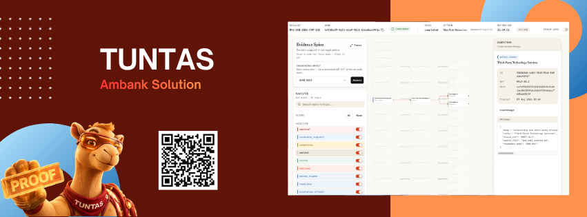
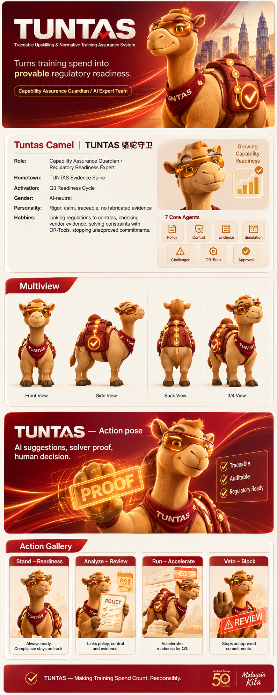
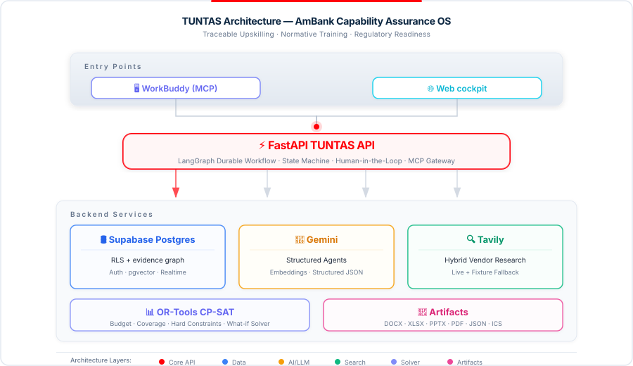

# TUNTAS

<p align="center">
  
</p>
<p align="center">
  
</p>
<p align="center">
  
</p>

**Traceable Upskilling & Normative Training Assurance System**

> Turns training spend into provable regulatory readiness.

TUNTAS is the AmBank **Case Study 4** hackathon backend: a Capability Assurance OS that maps skill gaps → regulatory controls → competency paths → budget-feasible portfolios → human approval → schedule/artifacts → post-training behavioural evidence.


## Architecture

Demo - https://youtu.be/UkGNcHOeJ0U



### Agent graph (LangGraph)

1. **Diagnostic** — cohort gap aggregation + risk narrative (parallel)  
2. **Policy Compiler** — BNM RMiT / AML-CFT / PDPA / MY AI (NSC07/TC17) → controls → FSF competencies (parallel)  
3. **Vendor Intelligence** — fixture catalog + live Tavily evidence (parallel)  
4. **Learning & Simulation Architect** — Level 1→3 modules + rubrics with `required_signals`  
5. **Procurement & Privacy Challenger** — deterministic privacy/DPA veto engine (+ LLM narrative) **before** optimize  
6. **OR-Tools Optimizer** — three portfolios: Budget Saver / Balanced / Max Risk Reduction  
7. **Management Secretariat** — decision brief only (no artifact commitment)  
8. **HITL interrupt** — no schedule / procurement / artifacts until manager approval  
9. **Finalize** — atomic decision+sessions+audit+outbox, then export pack  
10. **Assurance Monitor** — Kirkpatrick L1–4 snapshot + residual risk (graph node)

Simulation Level awards use **deterministic rubric scoring** (`app/services/rubric.py`), not Gemini.

### Evidence Spine

Postgres typed `evidence_nodes` / `evidence_edges` (not Neo4j). Path pattern:

`readiness → policy_clause → control → competency → course → simulation_attempt → approval`

Policy version changes use a recursive blast-radius query over the same graph.

## Features

TUNTAS is organised around a **Run Center** and a six-section **Assurance Workspace**. Each run keeps one ID across planning, approval, delivery, simulation, evidence, and audit.

### Pages at a glance

| Page | Route | What it is for | What you can do |
|---|---|---|---|
| **Run Center** | `/runs` | Executive entry point across all capability-planning runs | Check API health, view real backend metrics, inspect recent run status, open an existing run, or create a new one |
| **New Run Wizard** | `/runs/new` | Safely create a capability-planning request | Upload/paste trigger JSON or explicitly select Demo Data; review privacy aggregates and constraints; create the run and execute LangGraph |
| **Overview** | `/runs/{runId}/overview` | Observe the live multi-agent workflow | Watch persisted Agent states through SSE, inspect the backend timeline, open typed handoffs, copy IDs/hashes, and follow the recommended next action |
| **Plan** | `/runs/{runId}/plan` | Compare plans and make the management decision | Review diagnostics and vendors, compare three OR-Tools portfolios, run what-if stress tests, approve/reject/revise, and complete re-approval after policy reopen |
| **Evidence** | `/runs/{runId}/evidence` | Trace every readiness conclusion to persisted evidence | Explore the Evidence Spine, filter node types, inspect nodes, load lineage, assess a policy-change blast radius, and selectively reopen affected paths |
| **Delivery** | `/runs/{runId}/delivery` | Show what is committed after approval | Before approval, prove that delivery is locked; after approval, inspect the Q3 calendar, capacity ledger, employee assignments, and generated management files |
| **Assurance** | `/runs/{runId}/assurance` | Measure readiness beyond course attendance | Review Kirkpatrick signals, residual risk, control coverage and snapshot history; launch scenarios, submit Quick Proof, and refresh post-training assurance |
| **Simulation Theatre** | `/runs/{runId}/simulate/{scenarioId}` | Produce employee-level behavioural evidence | Run an adaptive role-based drill, submit actions and rationale, resume/abandon a session, and finalise a deterministic rubric score with evidence hash |
| **Audit & Integrity** | `/runs/{runId}/audit` | Give managers and auditors one traceable record | Search events and handoffs, review approval history, download and verify artifacts, and inspect operational metrics |

### Run Center

The Run Center answers: **“What is happening across all capability programmes?”**

- **Pipeline Status** — total runs, completed runs, and runs waiting for management approval.
- **Governance & Risk** — citation coverage, hard-constraint violations, and approval-bypass attempts.
- **Operational Efficiency** — budget utilisation, average handoff latency, and artifact completeness.
- **Recent Runs** — request ID, employee count, current workflow node, status, and last update.
- **API Health** — confirms that the UI is connected to the real FastAPI backend; runtime does not silently fall back to mocks.

### New Run Wizard

The wizard separates intake into four understandable steps:

1. **Source** — upload JSON, paste JSON, or explicitly choose the synthetic demo fixture.
2. **Privacy Preview** — review only aggregated roles, units, locations, and pseudonymous data before execution.
3. **Constraint Review** — confirm budget, Q3 window, operational coverage, frameworks, and cohort size for uploaded/pasted input; synthetic mode deliberately waits for the backend fixture and shows exact values in the Plan header after create.
4. **Create + Execute** — create a durable run ID, navigate to Overview, and start the LangGraph workflow.

The demo fixture is always labelled **Demo Data**. It represents a 10-person, RM50,000 slice of the target 250-person programme.

### Overview: live Agent console

Overview answers: **“How did the system reach this recommendation?”**

- Displays Diagnostic, Policy, Vendor, Learning, Challenger, Optimizer, Secretariat, approval, and Assurance stages.
- Uses persisted handoffs or explicit completion events to mark an Agent complete — not client timers.
- Receives `status`, `audit`, and `handoff` updates through run-scoped **Server-Sent Events**; polling is only a fallback.
- Opens the **Handoff Inspector** for structured Pydantic payloads: source Agent, evidence IDs, confidence, input hash, review flag, and output JSON.
- Provides **Proof Lens** metadata so reviewers can see the endpoint, persisted ID, fetch time, and whether a value is measured, modelled, assumed, or unknown.

### Plan: tabs and decision controls

The Plan page keeps the three main tabs on the left and the What-if / Approval controls visible in the right decision rail.

| Plan tab/control | Purpose | What it shows or allows |
|---|---|---|
| **Decision Rail tab** | Compare the three feasible investment strategies | Budget Saver, Balanced, and Max Risk Reduction cards with cost, weighted coverage, operational coverage, assignments, solver status, hard constraints, and Challenger flags |
| **Diagnostics tab** | Understand who has which capability gap | Role × competency heatmap, role/unit/location filters, pseudonymous employee table, and employee detail drawer with gaps, readiness, assessments, schedule, and simulation attempts |
| **Audit Trail tab** | Review provider evidence before selecting a plan | Vendor shortlist, MYR price status, HRD Corp status, residency, evidence freshness, Q3 availability, prerequisites, capacity, live evidence snippets, critical vetoes, and evidence gaps |
| **Constraint Stress Test** | Test whether management constraints are achievable | Change per-employee cap, total budget, or minimum coverage; run a real server-side CP-SAT recalculation; preview or apply the versioned result to the LangGraph checkpoint |
| **Management Approval** | Enforce the human decision boundary | Select approve/reject/revise, enter rationale and conditions, choose a revise stage, and submit with idempotency and stale-portfolio protection |
| **Re-approval Gate** | Re-authorise a plan after policy impact | Automatically uses `/resume` after affected paths have been reopened and the durable LangGraph interrupt has been re-armed |

An option with failed hard constraints cannot be selected for approval. Before a successful approval response, no schedule or artifact is committed.

### Evidence Spine

Evidence answers: **“What persisted evidence supports this green status?”**

- Visualises policy clauses, controls, competencies, employees, courses, approvals, simulation attempts, readiness, assurance snapshots, and artifacts.
- Filters by node type and supports search, zoom, fit, focus, stack expansion, and node inspection.
- Loads server-side lineage for a selected node instead of inventing browser-only relationships.
- **Assess Framework Impact** highlights affected nodes, employees, and courses while fading unaffected paths.
- **Reopen Paths** selectively recompiles impacted work, marks evidence stale, and re-arms management approval.

This is a typed Postgres evidence graph, not Neo4j and not a decorative diagram.

### Delivery

Delivery answers: **“What did management actually commit?”**

Before approval it displays **No commitment before approval**. After approval it provides:

- a read-only Q3 month/week/list calendar in `Asia/Kuala_Lumpur`;
- session capacity and assigned-headcount information;
- employee-to-session assignments with employee drill-down;
- six native outputs: **DOCX, XLSX, PPTX, PDF, JSON, and ICS**;
- authenticated downloads with browser-side SHA-256 comparison;
- backend HMAC presence shown honestly as **Signature recorded**, not browser-verified.

### Assurance and Simulation

Assurance answers: **“Did training produce evidence of behaviour, not just attendance?”**

- **Kirkpatrick panel** — L1–L4 signals, with L3 requiring behavioural proof.
- **Residual Risk** — modelled risk state with evidence-aware labels.
- **Control Coverage** — which control paths have supporting readiness evidence.
- **Snapshot History** — persistent pre-delivery and post-training assurance over time.
- **Scenario Launcher** — four golden drills: fraud/mule-account, AML escalation, PDPA/vendor handling, and customer-service social engineering.
- **Quick Proof** — analyst path for structured deterministic evidence.
- **Refresh Assurance** — creates a new backend snapshot after simulation evidence changes.

The Simulation Theatre provides adaptive Gemini narration, but Gemini cannot award Level 3. Final level, score, critical failures, matched signals, attempt ID, and evidence hash come from the deterministic rubric.

### Audit tabs

| Audit tab | What readers can inspect |
|---|---|
| **Events** | Persisted workflow events filtered by event type, actor, or text; event IDs can be copied |
| **Handoffs** | Full typed Agent handoff archive with Agent filter, input hashes, IDs, and expandable JSON |
| **Approval** | Latest decision plus history, manager identity/role, rationale, conditions, timestamps, and input hash |
| **Artifact Integrity** | Artifact type, filename, size, SHA-256, recorded HMAC, and authenticated download/verification |
| **Global Metrics** | Backend metrics plus a clearly labelled assumption calculator; modelled values are not presented as realised ROI |

### Shared controls and integrations

- **Run Context Bar** — run/request ID, copy action, status, current node, selected option, last refresh, and live connection mode.
- **Proof Lens** — provenance overlay for reviewers and judges.
- **SSE live sync** — true run-scoped status/audit/handoff push with honest polling fallback.
- **Role-aware actions** — backend remains authoritative for viewer, analyst, manager, compliance, admin, and MCP-service permissions.
- **WorkBuddy MCP** — can start a run, inspect status, compare portfolios, submit a first management decision, explain evidence lineage, list artifacts, run what-if, assess policy impact, and refresh assurance through whitelisted tools.

## Tech Stack

| Layer | Choice | Where in code | Demo purpose |
|---|---|---|---|
| API | Python 3.12, FastAPI, Pydantic v2 | `app/main.py`, `app/api/` | REST + SSE cockpit contract |
| Orchestration | LangGraph (`interrupt` / `Command(resume=…)`) | `app/agents/pipeline.py` | HITL gate; interrupt/resume survives restart |
| LLM | Google Gemini (`google-genai`) structured JSON + embeddings (768-d) | `app/services/llm.py`, `app/agents/pipeline.py` | Structured agent handoffs; challenger/policy use fallback model |
| Data | Supabase Postgres, Auth JWKS, RLS-enabled schema `tuntas`, pgvector | `app/db/schema.sql`, `app/db/session.py`, `app/services/*`, `app/security/auth.py` | Durable domain state, audit chain, evidence graph; JWT RBAC (demo headers only in development) |
| Optimization | Google OR-Tools CP-SAT | `app/services/optimizer.py` | Budget / coverage / schedule feasibility — LLM never “does math” |
| Vendor research | Tavily (`hybrid` = live + versioned fixtures) | `app/services/vendors.py` | Live authenticated search (multi-query); results → `tuntas.vendor_evidence` + Evidence Spine. Hybrid keeps fixture catalog for hard MYR constraints while requiring live evidence when `TAVILY_API_KEY` is set |
| MCP | FastMCP / WorkBuddy HTTP gateway in isolated `mcp_server/` venv | `backend/mcp_server/server.py` | Same application services via whitelisted tools + `MCP_SERVICE_TOKEN` |
| Artifacts | python-docx, openpyxl, python-pptx, icalendar, WeasyPrint (real PDF) | `app/services/artifacts.py` | Management pack export |
| Skills taxonomy | AICB Future Skills Framework Excel/PDF under `backend/docs/` | `app/services/fsf_ingest.py` + `backend/docs/*.xlsx` | Official Skill Codes workbook → `tuntas.competencies` at run seed |

Prototype cloud is **Supabase**. Tencent Cloud adapters are reserved for post-sponsorship migration (env placeholders only).


## Repository layout

```text
ambank/
  README.md                
  SOURCE_CHECKLIST.md
  backend/
    .env.example
    requirements.txt
    app/                    ← FastAPI application
    data/
      triggers/             ← synthetic 10-person trigger (v1)
      fixtures/vendors.json
      policies/             ← versioned clause packs
    docs/                   ← AICB FSF PDFs/Excel
    mcp_server/             ← WorkBuddy MCP 
    scripts/
  frontend/              
```


## Environment

1. Copy `backend/.env.example` → `backend/.env`
2. Fill Supabase, Gemini, Tavily keys
3. Generate local secrets (never commit):

```bash
python -c "import base64,secrets; print(base64.urlsafe_b64encode(secrets.token_bytes(32)).decode())"  # APP_MASTER_ENCRYPTION_KEY
python -c "import secrets; print(secrets.token_urlsafe(48))"  # ARTIFACT_HMAC_KEY and MCP_SERVICE_TOKEN (different values)
```

Key variables are documented inline in `.env.example`.  
**Do not** put secrets in chat, git, or frontend.

Defaults of note:

- `PORT=8001`
- `ALLOW_SYNTHETIC_TRIGGER_FALLBACK=true`
- `VENDOR_RESEARCH_MODE=hybrid`
- `CALENDAR_PROVIDER=ics` (no Google OAuth required)
- `DEMO_AUTH_BYPASS=true` only for local demo (`X-Demo-Role` / `X-Demo-Actor`)


## Trigger input (Case 4)

Organiser table currently provided (no official JSON file yet):

| Field | Value |
|---|---|
| Request ID | MYS-GEN-2026-CAP-102 |
| Issuing Unit | Enterprise Risk, Operations & Compliance Division |
| Urgency | High |
| Target Cohort | 250 (ops / compliance / fraud / customer-service) |
| Capability Domain | Automated Fraud Detection, RegTech & Operational AI Governance |
| Proficiency | Level 1 → Level 3 |
| Max Budget | MYR 5,000 / employee |
| Timeline | Q3 2026 |
| Delivery | Hybrid / Blended Workshop |
| Frameworks | BNM RMiT, BNM AML/CFT, MY AI (NSC07/TC17), PDPA |

Backend uses a **v1 adapter** (`app/services/trigger.py`) and ships a **10-person synthetic cohort** for tests:

`backend/data/triggers/synthetic_mys_gen_2026_cap_102_v1.json`

### Golden demo fixture story

The synthetic path is explicitly labelled **Demo Data**. It is a pro-rated slice, not a claim that 10 records equal the target 250:

- target programme: 250 employees / RM1.25m ceiling；
- demo slice: 10 pseudonymous employees / RM50,000 budget；
- concentrated gaps: fraud risk (7), AML (5), AI governance (5), data protection (4)；
- featured `EMP-SYN-005` completed the fraud foundation but retains an advanced incident-response gap；
- local claimable AICB/ABS options contrast with ECIH (RM4,700, SG, non-claimable, quote review)；
- `GCX-REGTECH-ULTRA` looks broad at RM4,900 but is deterministically vetoed for missing DPA / US transfer risks；
- deterministic baseline produces three distinct feasible portfolios: approximately RM19.8k / 41% weighted coverage, RM31.2k / 71%, and RM37.9k / 78%.

Fixture vendor dossiers are in `backend/data/fixtures/vendors.json`; policy clause packs are in `backend/data/policies/`.

When the official `ambank_skill_gap_trigger.json` arrives, drop it at:

`ambank/source_materials/organiser/ambank_skill_gap_trigger.json`

No core model changes required — only the adapter input source changes. Scale employees to 250 then.

**NSC07/TC17** is treated as Standards Malaysia AI committee alignment (ISO/IEC AI family), not a single statute.


## Setup & run

```bash
cd ambank/backend
python3 -m venv .venv
source .venv/bin/activate
pip install -r requirements.txt

# Apply schema (also runs on API startup)
python scripts/apply_schema.py

# API (sets DYLD_LIBRARY_PATH for WeasyPrint on macOS)
chmod +x scripts/run_api.sh
./scripts/run_api.sh
# equivalent:
# export DYLD_LIBRARY_PATH="/opt/homebrew/lib:$DYLD_LIBRARY_PATH"
# uvicorn app.main:app --reload --port 8001
```

Health: `GET http://127.0.0.1:8001/health`

### Demo auth (local)

```bash
curl -s http://127.0.0.1:8001/v1/runs \
  -H 'Content-Type: application/json' \
  -H 'X-Demo-Role: manager' \
  -H 'X-Demo-Actor: demo-manager' \
  -d '{"use_synthetic_fallback":true}'
```

### Happy path

```bash
# 1) create  2) execute  3) GET options  4) POST decision  5) artifacts / blast-radius
./scripts/smoke_http.sh http://127.0.0.1:8001
```

### WorkBuddy MCP (separate process)

```bash
cd ambank/backend/mcp_server
python3 -m venv .venv
source .venv/bin/activate
pip install -r requirements.txt
python server.py
# HTTP MCP at http://127.0.0.1:8787/mcp
```

Whitelisted tools: `start_capability_run`, `get_run_status`, `compare_portfolio_options`, `submit_management_decision`, `explain_readiness`, `export_management_pack`, `assess_policy_change` (optional reopen+recompile), `what_if_portfolios`, `refresh_assurance`.

MCP authenticates with `X-MCP-Token: $MCP_SERVICE_TOKEN` and cannot invent new backend routes.


## REST API (v1)

| Method | Path | Purpose |
|---|---|---|
| GET | `/v1/runs` | List recent runs (cockpit home) |
| POST | `/v1/runs` | Create run from organiser/synthetic trigger |
| POST | `/v1/runs/{id}/execute` | Run agent graph until approval gate |
| GET | `/v1/runs/{id}` | Status + options + events |
| GET | `/v1/runs/{id}/cockpit` | **Aggregated cockpit first-paint** |
| GET | `/v1/runs/{id}/handoffs` | Typed agent handoff envelopes |
| GET | `/v1/runs/{id}/timeline` | Unified agent + audit timeline |
| GET | `/v1/runs/{id}/evidence-graph` | Full Evidence Spine for @xyflow |
| GET | `/v1/runs/{id}/employees` | Cohort drill-down list |
| GET | `/v1/runs/{id}/employees/{ref}` | Employee readiness / schedule / attempts |
| GET | `/v1/runs/{id}/scenarios` | Four Level-3 proof scenarios |
| GET | `/v1/runs/{id}/sessions` | Approved Q3 training sessions |
| GET | `/v1/runs/{id}/assignments` | Employee↔session assignments |
| GET | `/v1/runs/{id}/assurance` | Assurance snapshots (newest first) |
| GET | `/v1/runs/{id}/approval` | Latest HITL decision |
| GET | `/v1/runs/{id}/events` | Append-only audit timeline |
| GET | `/v1/runs/{id}/events/stream` | **SSE realtime** (`status` / `audit` / `handoff`) |
| GET | `/v1/runs/{id}/status` | Lightweight status (polling fallback) |
| GET | `/v1/runs/{id}/options` | CP-SAT portfolios **with assignments** |
| GET | `/v1/runs/{id}/options/{key}` | Single portfolio detail |
| POST | `/v1/runs/{id}/decision` | Manager HITL approve/reject/revise |
| POST | `/v1/runs/{id}/resume` | Alias of decision |
| GET | `/v1/runs/{id}/artifacts` | Management pack files |
| GET | `/v1/artifacts/{id}` | Download artifact |
| POST | `/v1/simulations/{id}/attempts` | One-shot rubric-scored Level 3 proof |
| POST | `/v1/simulations/{id}/sessions` | Start adaptive multi-turn drill (LLM narrates) |
| POST | `/v1/simulations/sessions/{id}/turns` | Learner action → adaptive next turn |
| POST | `/v1/simulations/sessions/{id}/finalize` | Close drill; deterministic rubric scores |
| GET | `/v1/evidence/{id}/lineage` | Evidence spine walk from one node |
| POST | `/v1/runs/{id}/what-if` | Instant CP-SAT re-solve (budget/coverage sliders) |
| GET | `/v1/runs/{id}/blast-radius?framework_code=` | Policy change impact query |
| POST | `/v1/runs/{id}/blast-radius/reopen` | Mark stale + selective recompile + **re-arm LangGraph `interrupt()`** → re-approval |
| POST | `/v1/runs/{id}/assurance/refresh` | Post-training Assurance Monitor refresh |
| GET | `/v1/metrics/summary` | Demo-honest KPIs |

Hard rules enforced in code:

- Per-employee cost ≤ RM 5,000  
- Portfolio total ≤ scaled cohort budget  
- Operational coverage: OR-Tools per-person Q3 schedule under requested `min_operational_coverage_ratio` (no softener)  
- Prerequisite courses + class capacity are CP-SAT hard constraints (not decorative fields)  
- HRD Corp claimability is structured per course (`hrd_corp_claim_status` / `hrd_corp`)  
- Handoff persist uses Pydantic `model_validate` per agent payload  
- Challenger veto removes weak privacy vendors before approval  
- No schedule/artifacts commitment until approval  
- Approval bypass attempts are audited  
- Assurance: `pre_delivery` baseline after approve; `post_training` refresh after simulation attempts


## License

This project is licensed under the [MIT License](./LICENSE).